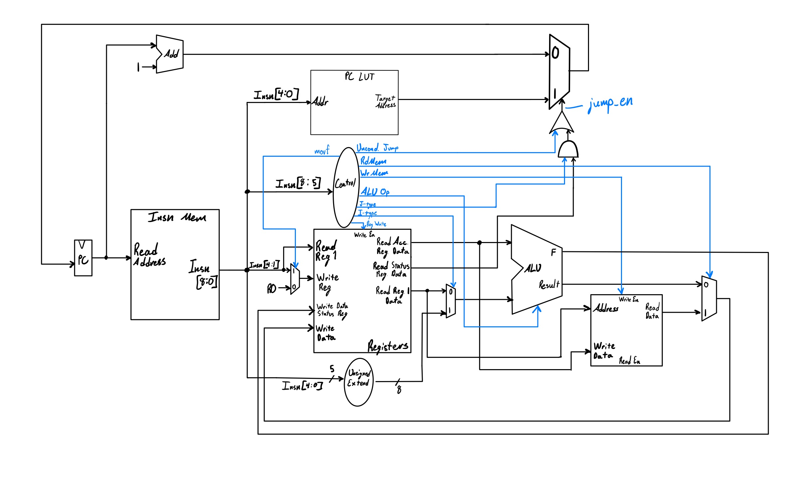
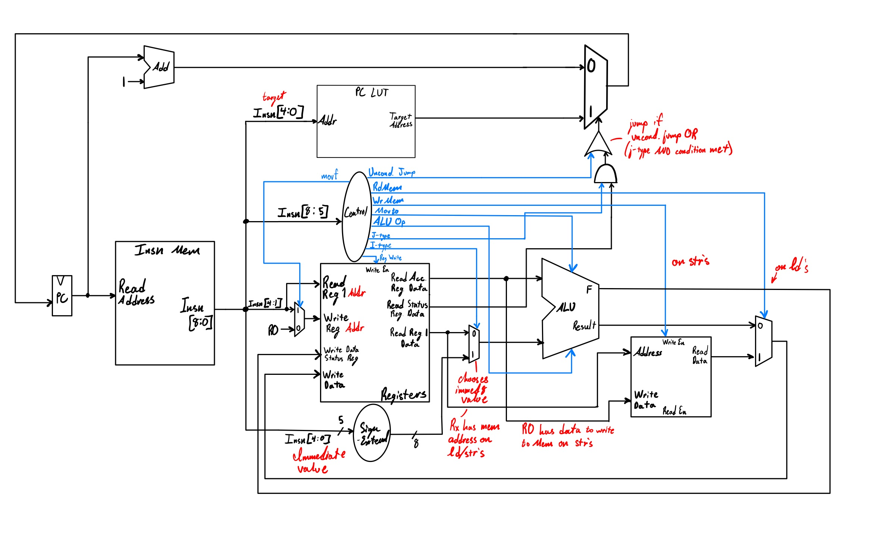

# CSE 141L Project

Hello! This is a project created for UCSD's CSE141L (Computer Architecture Lab) where we were assigned the task of designing and build a custom ISA, architecture, and single-cycle datapath to able to implement particular algorithms.
The ISA is a 9-bit architecture, designed for 16 register hardware, and supports MIPS-esque R, J, and I type operations.

The design was simulated and tested using SystemVerilog in ModelSim.

### Single Cycle Datapath

### Annotated DataPath

https://www.youtube.com/watch?v=AfGSqvyOXYw
